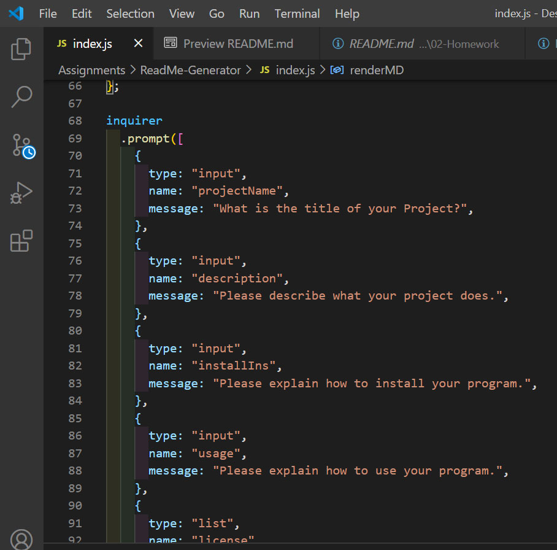

# Readme Generator

## Description

This program is a Command Line Interface that generates a new README.md file from the prompts given. It requests Installation and Usage instructions, which license might apply to the project, how to contribute (or who contributed), any tests that might be included or run to verify the code, and it requests the Github Repo link, the deployed Github link and LinkedIn/email information for further contact.

###Table of Contents

- [Installation](#Installation)
- [Usage](#Usage)
- [License](#License)
- [Contributing](#Contributing)
- [Tests](#Tests)
- [Questions](#Questions)

###<a name="Installation">Installation</a>
Open an integrated terminal in the program folder and type in 'npm i' to initialize the dependencies.

###<a name="Usage">Usage</a>
Type in node index.js and then asnwer the questions with as much detail as possible.

###<a name="License">License</a>
[]

###<a name="Contributing">Contributing</a>
There were no additional contributions to the development of this program.

###<a name="Tests">Tests</a>
There are no tests developed for this program.

###<a name="Questions">Questions</a>
"What is the title of your Project?"
"Please describe what your project does."
"Please explain how to install your program."
"Please explain how to use your program."
"Which license does this project utilize?"
"What are your contribution guidelines?"
"Which tests should be run?"
"What is the URL of your Github Repo?"
"What is the Github URL of your deployed project?"
"What is your LinkedIn URL?"
"What is your email?"

#### Learn More/Contact Me:

##### Github Repo URL: [Click Here](https://github.com/falconreid/ReadMe-Generator)

##### Deployed Github URL: [Click Here](none)

##### LinkedIn profile: [Click Here](https://www.linkedin.com/in/joelterrell/)

##### Email: [falconreid@hotmail.com](mailto:falconreid@hotmail.com)

#### Video Link: [Click Here for Video](https://drive.google.com/file/d/1BUTI80FiTNXFWIIgZUXBFGaTbasAQbEj/view)

